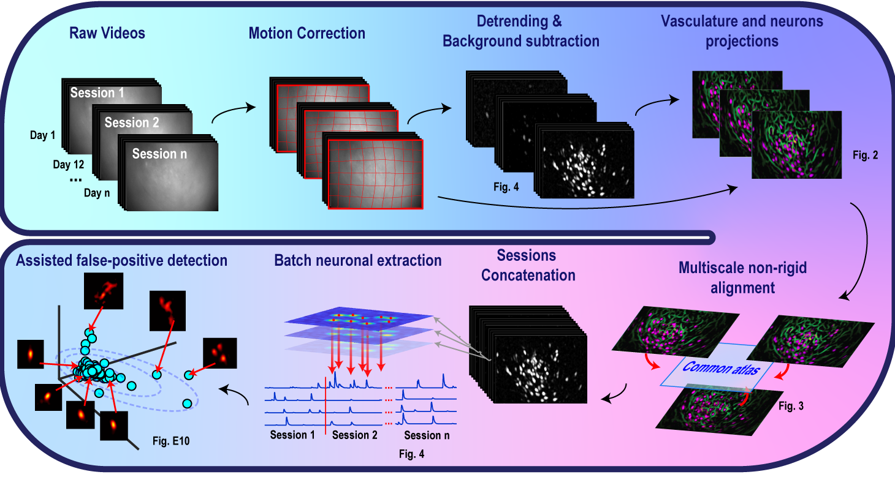

  

# CaliAli: A Comprehensive Suite for Extracting Neural Signals from One-Photon Calcium Imaging Data in multi-session experiments

CaliAli is a powerful software suite designed to extract neural signals from one-photon calcium imaging data collected across multiple sessions in free-moving conditions.

Read the full [Online Documentation](https://caliali-pv.github.io/CaliAli/)

### Important Notice: CaliAli Update

CaliAli has undergone a major update! The previous version of the code described in the [BioRxiv preprint](https://www.biorxiv.org/content/10.1101/2023.05.19.540935v1) is now deprecated. If you need to access that version of the code, please switch to the BioRxiv branch.

For detailed information about the latest changes and updates, please refer to the new [Online Documentation](https://caliali-pv.github.io/CaliAli/).

---

