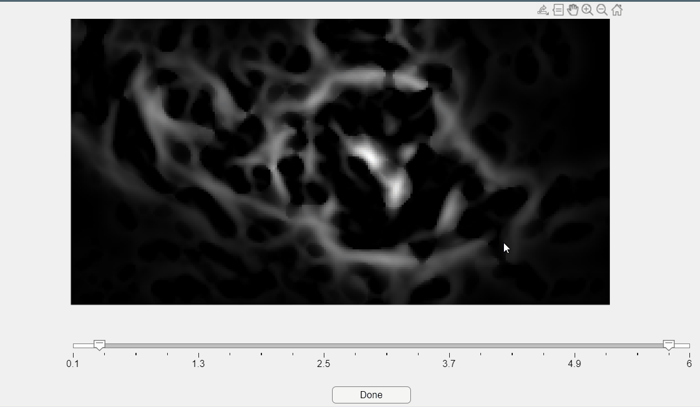

### BV_app {#BV_app}

#### Description
Interactive graphical interface to estimate the optimal blood vessel (BV) size for use in the CaliAli motion correction pipeline. This tool processes a single video frame to extract blood vessel candidates across a range of sizes and allows the user to manually select the optimal diameter range.

##### Function Inputs:
| Parameter Name | Type     | Description                                                                 |
|----------------|----------|-----------------------------------------------------------------------------|
| lim            | Vector   | (Optional) Range of vessel radii to evaluate, in pixels. Default: `0.1:0.05:6` |

##### Function Outputs:
| Output Name | Type       | Description                                                                 |
|-------------|------------|-----------------------------------------------------------------------------|
| r           | 1×2 vector | Selected BV size range `[min_diameter, max_diameter]` in pixels, as chosen by the user |

##### Example usage:
```matlab
r = BV_app();           % Use default vessel size range
r = BV_app(0.2:0.1:5);  % Custom range for fine vessel selection
```


!!! Info "The median frame is used for vessel extraction if motion correction has already been applied."

??? note "This function only accepts `.mat` files containing preprocessed video data."
    You will be prompted to select a single `.mat` file. The selected file must contain a video variable `Y`, compatible with the CaliAli format and structure.  
    The frame used for vessel detection depends on whether the file is motion-corrected:  
    - If the filename contains `_mc`, the **median frame** across time is used.  
    - Otherwise, a **Gaussian-filtered middle frame** is selected.

#### Vessel Size Selection Interface

The app will open a window showing the vessel detection results across the provided size range.

In this window:
- Use the **dual slider** to select the vessel size range `[min, max]`.
- The panel updates interactively to reflect the vessel masks detected at each size.

Once satisfied, press `Ok!` to confirm your selection.  
The selected range will be printed in the MATLAB console:

```matlab
The chosen Blood vessels sizes are [0.60, 2.00]
```

???+ Bug
    This function requires **MATLAB R2023b** or later due to its use of the **dual-slider** component in App Designer. This UI feature is not available in earlier versions of MATLAB.

##### Internally, the function performs the following:
- Loads the video using `CaliAli_load`.
- Applies **vignetting correction** with `remove_vignetting_video_adaptive_batches`.
- Applies **border removal** via `remove_borders`.
- Detects blood vessel candidates using `BV_stack`.
- Launches an interactive GUI using `BV_app_in` for manual range selection.
