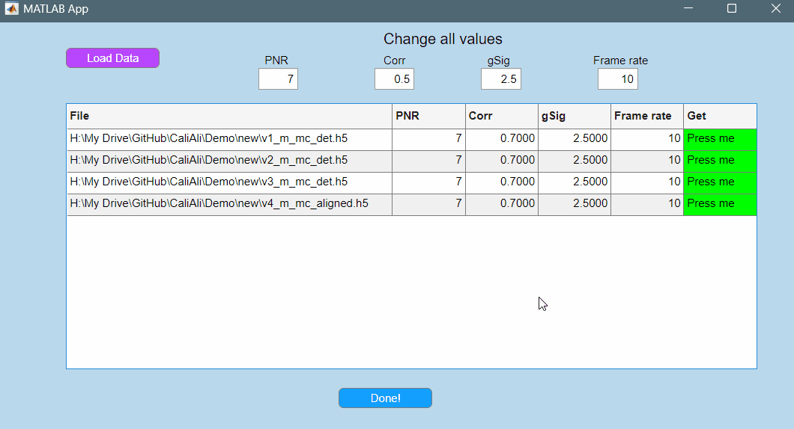
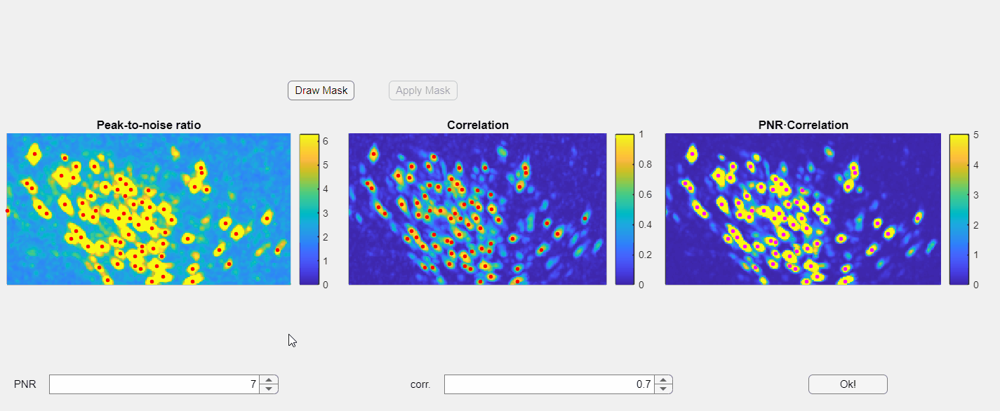

### CaliAli_set_initialization_parameters {#CaliAli_set_initialization_parameters}

```matlab
function CaliAli_set_initialization_parameters()
```

#### Description
Opens the app where you choose, for each file, the PNR and correlation thresholds, the neuron size `gSig` and an optional seed mask used to initialize CNMF-E. Press **Load Data** to choose the `_Aligned.mat` or `_det.mat` files; each file appears as a row of the table.

- Edit a value directly in the table, or type it in a **Change all values** box and press Enter to apply it to every file.
- Press `Get` on a row to set its thresholds visually (see below).
- Press `Done!` to save the values shown in the table to each file. If `gSig` changed, the settings derived from it are updated too.

##### Function Inputs:
None. An input passed by older scripts (such as `CaliAli_options`) is ignored: the app reads the settings from the files it loads.

##### Function Outputs:
None. The settings are saved in the `CaliAli_options` of each file.

##### Example usage:
```matlab
CaliAli_set_initialization_parameters();
```

!!! Info "You can process several files at the same time."

??? note "This app can only be used with videos processed by CaliAli"
    Before using this application, files must be processed to calculate relevant projections (neurons, BV).  
    This preprocessing step is performed when running [CaliAli_align_sessions](CaliAli_align_sessions.md) or  [detrend_batch_and_calculate_projections](detrend_batch_and_calculate_projections.md).  
    You cannot run this code on a video that has not undergone these steps, as the necessary projections will not be calculated.

#### Adjusting PNR and Correlation Thresholds <a id="adjust_pnr"></a>

To visually set the PNR and Corr. threshold press the `Get` button highlighted in green for any of the loaded videos:



???+ Bug
	Sometimes, the MATLAB AppDesigner app may not render panels correctly. This is a MATLAB bug. If this happens, just close and reopen the window to fix the issue.

In the opened window, you will find three images displayed: the PNR image, the correlation image, and their point-wise product. Red dots overlaid on these images represent candidate neurons or "seed pixels". Below these images, there are two spinners that control the PNR and correlation thresholds. Adjusting these thresholds will change the number of seed pixels detected:



Additionally, you have the option to manually draw a mask to exclude specific regions within the field of view:


???+ Bug
	Currently you can only draw the mask in the correlation image.
	
???+ Danger "Important"
	Please note that the initialization of neurons depends solely on the third panel, which is the point-wise product of the correlation and PNR (peak-to-noise ratio). Even if some seeds appear above non-neuronal structures in either the correlation or PNR images, this will not compromise the extraction process as long as those seeds do not appear in the point-wise product image
	
Once satisfied with the results press the `Ok!` button: the row of that file is updated with the new values. Closing the window without `Ok!` keeps the previous values.

When the table shows the values you want, press `Done!` to save them.

!!! tip "Double-check neuron counts"
    Before launching [`CaliAli_cnmfe`](CaliAli_cnmfe.md#CaliAli_cnmfe), call [`Check_initialization_parameters`](Check_initialization_parameters.md#Check_initialization_parameters) to preview how many neurons will be seeded with the current thresholds. If the count looks unrealistic, reopen the app and adjust `min_corr`, `min_pnr`, or the seed mask.
