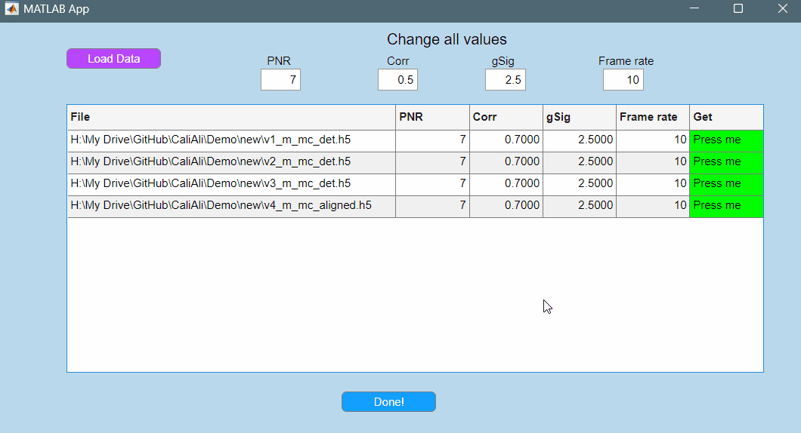
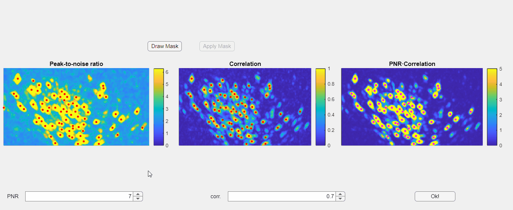

### CaliAli_set_initialization_parameters {#CaliAli_set_initialization_parameters}

```matlab
function CaliAli_set_initialization_parameters(CaliAli_options)
```

#### Description
Graphic user interface for setting initialization parameters for CNMF-E processing. Function will call a file selector windows to choose the files to process.

##### Function Inputs:
| Parameter Name | Type    | Description                          |
|---------------|---------|--------------------------------------|
| CaliAli_options | Structure | Structure containing preprocessing settings. |

##### Function Outputs:
None: Initialization parameters are stored inside the CaliAli_options structure of each file


##### Example usage:
```matlab
CaliAli_set_initialization_parameters(CaliAli_options);
```

!!! Info "You can process several files at the same time."

??? note "This app can only be used with videos processed by CaliAli"
    Before using this application, files must be processed to calculate relevant projections (neurons, BV).  
    This preprocessing step is performed when running [CaliAli_align_sessions](CaliAli_align_sessions.md) or  [detrend_batch_and_calculate_projections](detrend_batch_and_calculate_projections.md).  
    You cannot run this code on a video that has not undergone these steps, as the necessary projections will not be calculated.

#### Adjusting PNR and Correlation Thresholds <a id="adjust_pnr"></a>

To visually set the PNR and Corr. threshold press the `Get` button highlighted in green for any of the loaded videos:



???+ Bug
	Sometimes, the MATLAB AppDesigner app may not render panels correctly. This is a MATLAB bug. If this happens, just close and reopen the window to fix the issue.

In the opened window, you will find three images displayed: the PNR image, the correlation image, and their point-wise product. Red dots overlaid on these images represent candidate neurons or "seed pixels". Below these images, there are two spinners that control the PNR and correlation thresholds. Adjusting these thresholds will change the number of seed pixels detected:



Additionally, you have the option to manually draw a mask to exclude specific regions within the field of view:


???+ Bug
	Currently you can only draw the mask in the correlation image.
	
???+ Danger "Important"
	Please note that the initialization of neurons depends solely on the third panel, which is the point-wise product of the correlation and PNR (peak-to-noise ratio). Even if some seeds appear above non-neuronal structures in either the correlation or PNR images, this will not compromise the extraction process as long as those seeds do not appear in the point-wise product image
	
Once satisfied with the results press the `Ok!` button.
This will automatically update the parameters for the chosen file with the new thresholds. 

After setting the PNR, Corr, gSig, and Frame rate parameters press `Done!`

