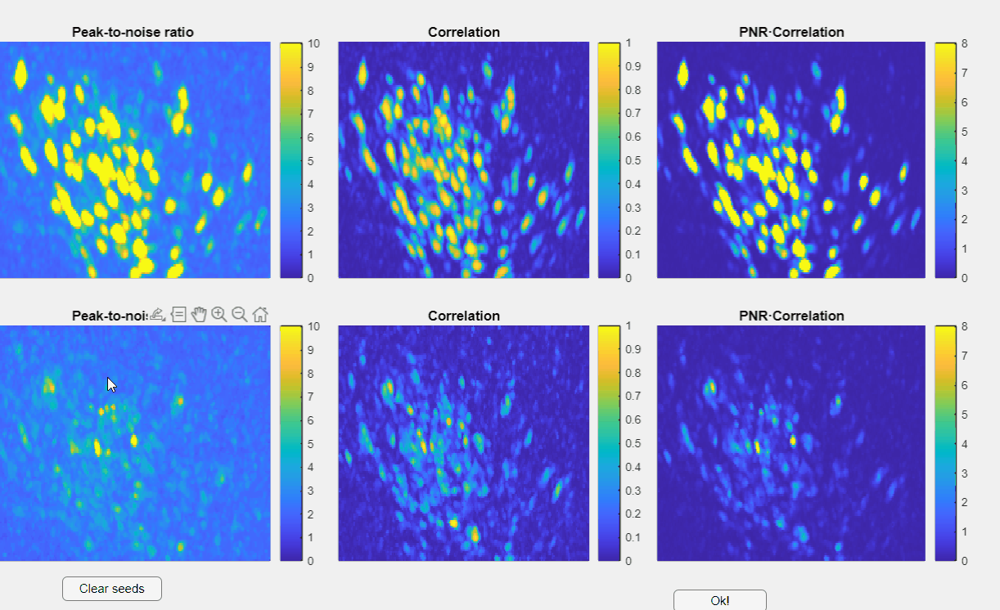

### manually_update_residuals {#manually_update_residuals}

```matlab
function neuron=manually_update_residuals(neuron,use_parallel)
```

#### Description
manually_update_residuals: Iteratively refines residuals in CNMF-E extracted components.

##### Function Inputs:
| Parameter Name | Type    | Description                                 |
|---------------|---------|---------------------------------------------|
| neuron        | structure | CNMF-E extracted neuron structure containing spatial (A) and temporal (C_raw) components. |
| use_parallel  | boolean   | Boolean flag to enable parallel computation for speed-up. |

##### Function Outputs:
| Parameter Name | Type    | Description                                 |
|---------------|---------|---------------------------------------------|
| neuron        | structure | Updated neuron structure with refined residuals. |

##### Example usage:
```matlab
neuron = manually_update_residuals(neuron, true);
```
This will open a GUI displaying the PNR, Corr., and PNR*Corr. images(1). These images will be shown in their original form (top panels) and also after subtracting the current neuron detections from the video (Residual video) (bottom panels).
{ .annotate }

1.	Refer to [Select Extraction Parameters](../extraction.md#gui) for a description of the PNR, Corr. and PNR*Corr images.


Here, you can manually add initialization seeds for undetected neurons. Clicking on any of these images will place a red dot that initializes these neurons:




This will initialize these neurons and repeat the CNMF process required to [extract the Calcium signals](../extraction.md#ecs).

???+ Tip
	In most cases picking neurons is not necessary.
