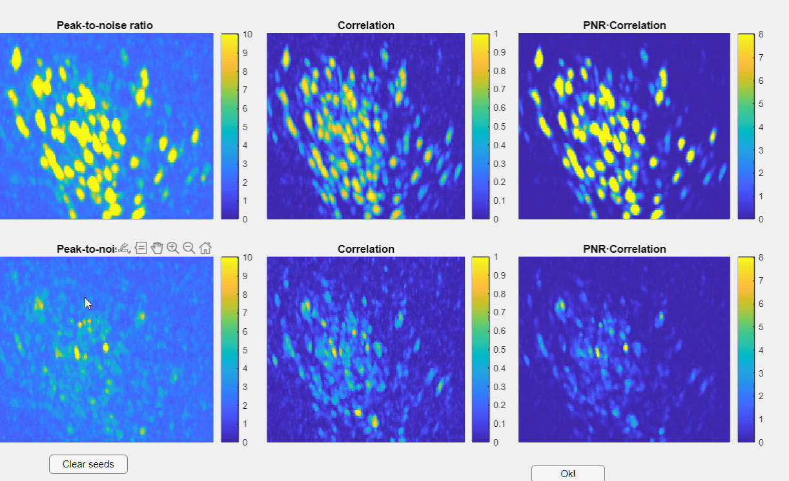

### manually_update_residuals {#manually_update_residuals}

```matlab
function neuron=manually_update_residuals(neuron,thr,use_parallel,update_temporal,seeds)
```

#### Description
manually_update_residuals: Adds neurons missed by the extraction, starting from seeds placed on the residual images, and repeats the CNMF iterations.

##### Function Inputs:
| Parameter Name | Type    | Description                                 |
|---------------|---------|---------------------------------------------|
| neuron        | CNMF-E neuron object | Output of [CaliAli_cnmfe()](CaliAli_cnmfe.md#CaliAli_cnmfe). |
| thr           | double  | Threshold for drawing the contours of the detected neurons (e.g. `0.6`). |
| use_parallel  | boolean | Enable parallel computation for speed-up. |
| update_temporal | boolean | (Optional) Only used for results saved before CaliAli 1.5.0, which do not store the noise scaling of the traces: re-estimate the traces before the new neurons are added. Default `true`. |
| seeds         | vector  | (Optional) Linear pixel indices where new neurons are initialized. If omitted, a window opens to pick them by clicking. |

##### Function Outputs:
| Parameter Name | Type    | Description                                 |
|---------------|---------|---------------------------------------------|
| neuron        | CNMF-E neuron object | Updated `neuron` including the new neurons. |

##### Example usage:
```matlab
neuron = manually_update_residuals(neuron, 0.6, true);
```
This will open a GUI displaying the PNR, Corr., and PNR*Corr. images(1). These images will be shown in their original form (top panels) and also after subtracting the current neuron detections from the video (Residual video) (bottom panels).
{ .annotate }

1.	Refer to [Picking Neurons from Residual](../extraction.md#residual) for a description of the PNR, Corr. and PNR*Corr images.


Here, you can manually add initialization seeds for undetected neurons. Clicking on any of these images will place a red dot that initializes these neurons (`Clear seeds` removes them). Press `Ok!` when done:




This will initialize these neurons and repeat the CNMF process required to [extract the Calcium signals](../extraction.md#ecs), including the final noise scaling, detrending and deconvolution of the traces.

At the end, the components are re-ordered by SNR and the workspace is saved as a new [checkpoint](../extraction.md#chk) (`save_workspace`).

???+ Tip
	In most cases picking neurons is not necessary.
