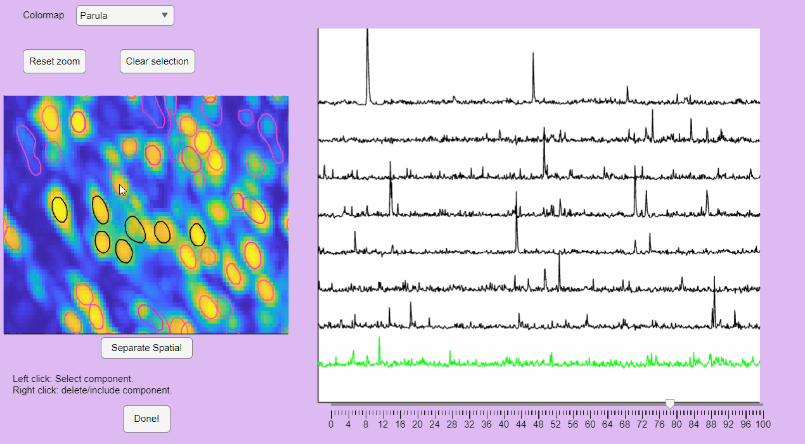
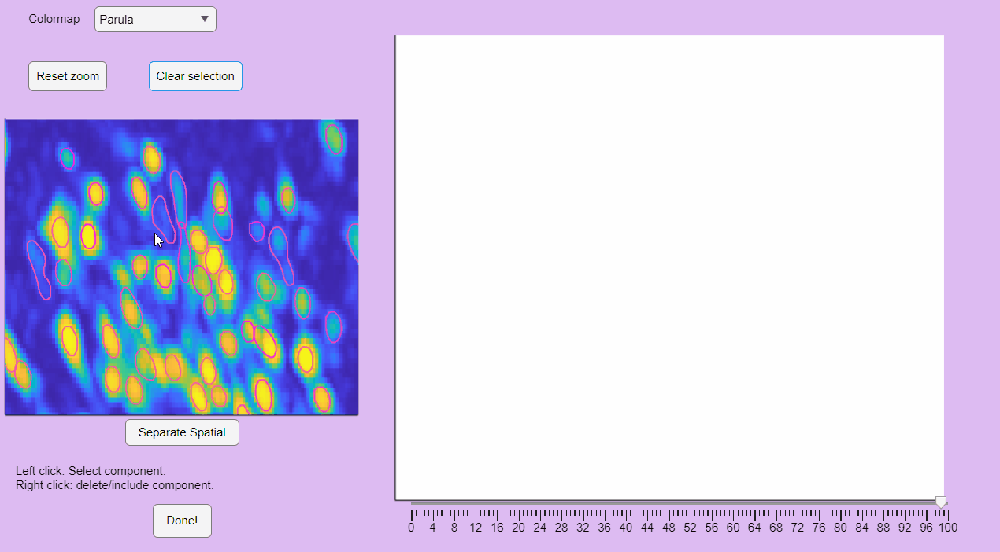
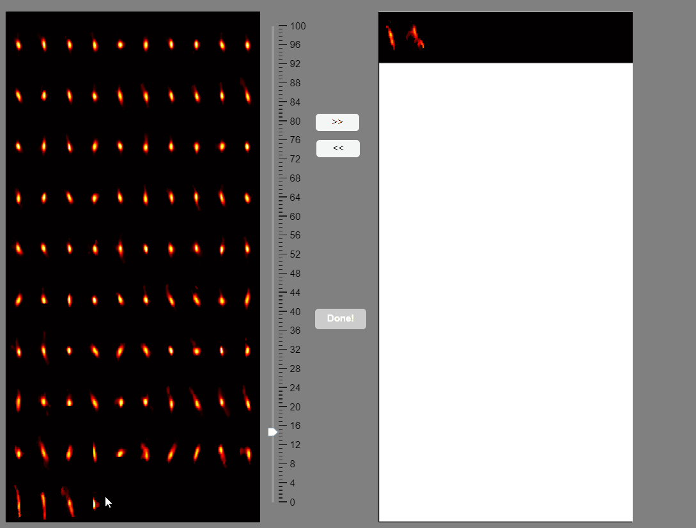

#### Syntac
```matlab
function ix=postprocessing_app(neuron,thr)
```

#### Description
Interactive labeling and classification of CNMF-E components.

##### Function Inputs:
| Parameter Name | Type   | Description                  |
|----------------|--------|------------------------------|
| neuron         | struct | CNMF-E neuron structure containing extracted components. |
| thr            | double | Threshold for drawing neuron contours. |

##### Function Outputs:
| Parameter Name | Type    | Description                                      |
|----------------|---------|--------------------------------------------------|
| ix             | logical | Logical index of selected components, where selected components are those labeled in all three projection views. |

##### Example usage:
```matlab
ix = postprocessing_app(neuron, 0.8);
```

The post-processing app will display the correlation image with overlaid contours of the detected neurons. Clicking on these contours will show the corresponding extracted calcium transients:


You can hold you mouse to zoom:


You can reset the zoom and clear the neuronal selection by pressing the buttons located above the correlation image:



You can label false positives by right-clicking on the neuron contours:




### Sort Spatial Components <a id="spatial_sort"></a>

CaliAli can label false positives based on the shape of the extracted spatial components. To accomplish this, CaliAli incorporates a tool that sorts spatial components by their spatial congruence. To utilize this function, press the 'Separate Spatial' button.

This will open a panel displaying all the extracted spatial components. Components with congruent shapes are sorted at the beginning, while neurons with shapes different from the rest of the population are sorted last. Components labeled as false-positives will be listed on the right.


Note that elongated components, which could correspond to neuropil signals rather than neuron somas, appear at the bottom of the list. You can select these components and move them to the false-positive panel.



Once satisfied with the selections press the `Done!` button.

This will label the component as false-positive in the correlation image. 
