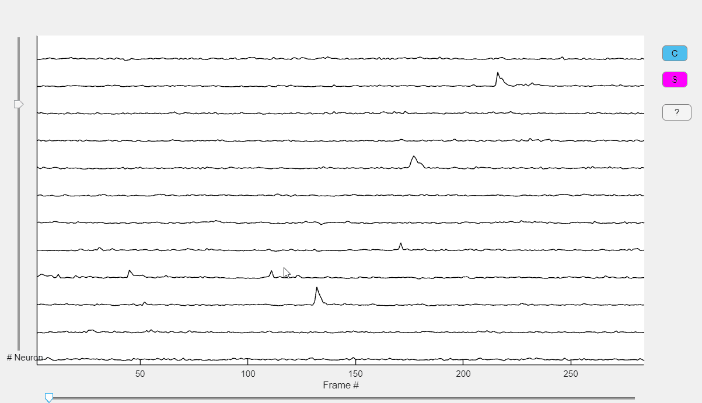

### view_traces {#view_traces}

#### Syntax

```matlab
view_traces(neuron)
view_traces(neuron, inp)
```

#### Description
Interactive visualization of calcium traces obtained with CNMF-E.

##### Function Inputs:
| Parameter Name | Type    | Description                                                                 |
|---------------|---------|-----------------------------------------------------------------------------|
| neuron        | CNMF-E neuron object | Output of [CaliAli_cnmfe()](CaliAli_cnmfe.md#CaliAli_cnmfe). |
| inp           | vector  | (Optional) Indices (or a logical mask) of the components to display. Default: all components. |

##### Function Outputs:
None (displays the selected traces interactively).

##### Example usage:
```matlab
view_traces(neuron);          % all components
view_traces(neuron, 1:20);    % components 1 to 20
```
#### Monitoring Extracted Calcium Transients <a id="mt"></a>

CaliAli includes an app to plot the extracted calcium signals. After loading the `neuron` object, run `view_traces(neuron)`.



The raw traces (`neuron.C_raw`) are plotted in black. This app includes the following functionalities:

-	++left++ / ++right++ 	Scroll back or forward. Alternatively, you can use the scroll bar at the bottom of the screen.
-	++up++ / ++down++ 	Move through the traces. Alternatively, use the vertical scroll bar.
-	++shift+up++ / ++shift+down++	Increase/decrease the number of traces being displayed. 
-	++shift+right++ / ++shift+left++	Increase/decrease the temporal resolution.
-	Use the mouse scroll wheel to change the vertical zoom.
- 	Press the `C` button to plot the denoised traces (`neuron.C`, red).
- 	Press the `S` button to plot the deconvolved activity (`neuron.S`, magenta), which marks the predicted rising events.
- 	Press the `?` button to show a summary of the keyboard commands.
