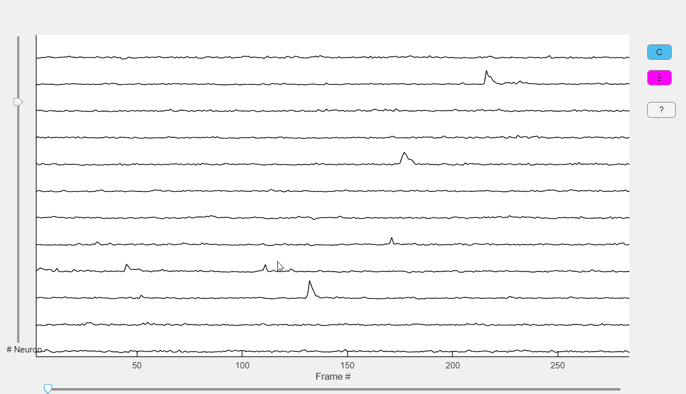

### view_traces {#view_traces}

#### Syntax

```matlab
function view_traces()
```

#### Description
Interactive visualization of calcium traces obtained with CNMF-E.

##### Function Inputs:
| Parameter Name | Type    | Description                                                                 |
|---------------|---------|-----------------------------------------------------------------------------|
| Neuron           | CNMF-E neuron object | Output of CNMF-E and CaliAli_cnmf()    |

##### Function Outputs:
None (displays the selected traces interactively).

##### Example usage:
```matlab
view_traces(neuron);
```
#### Monitoring Extracted Calcium Transients <a id="mt"></a>

CaliAli includes an app to plot the extracted calcium signals. After loading the `neuron` object, run `view_traces(neuron)`.



This app includes the following functionalities:

-	++left++ / ++right++ 	Scroll back or forward. Alternatively, you can use the scroll bar at the bottom of the screen.
- 	Use the vertical scroll bar to navigate through traces.
-	++shift+up++ / ++shift+down++	Increase/decrease the number of traces being displayed. 
-	++shift+right++ / ++shift+left++	Increase/decrease the temporal resolution.
-	Use the mouse scroll wheel to change the vertical zoom.
- 	Press the `C` button to plot the denoised traces.
- 	Press the `S` button to plot the predicted rising events.
