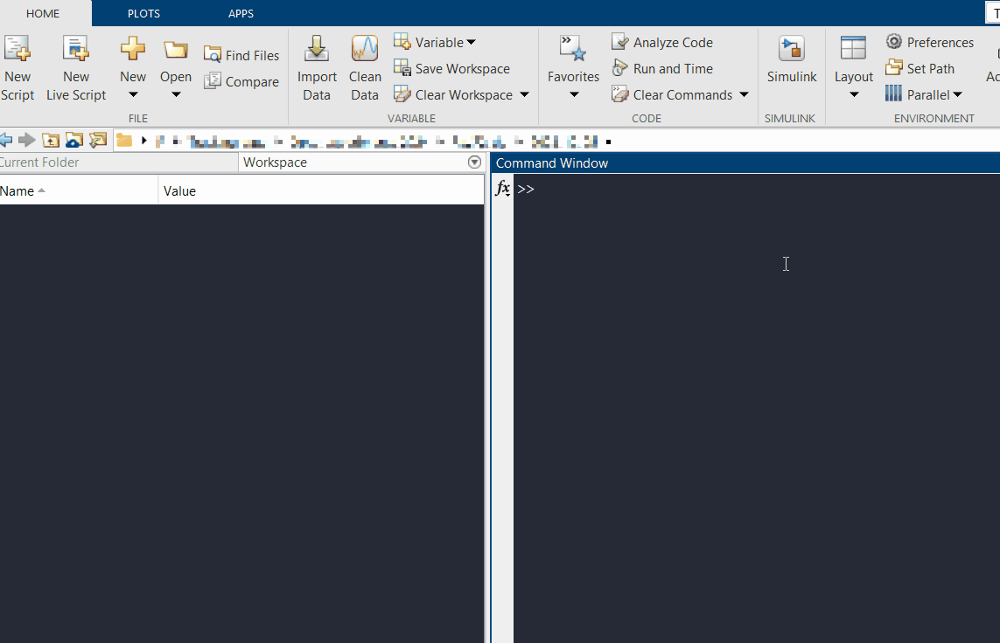

# Installation and system requirements

#### System Requirements <a id="requirement"></a>
CaliAli runs in `MATLAB` and requires:
```
-	Signal Processing Toolbox
-	Image Processing Toolbox
-	Statistics and Machine Learning Toolbox
-	Parallel Computing Toolbox
```
		
#### System Compatibility and Supported Formats <a id="supported-formats"></a><a id="compatibility"></a>

??? Question "Platform and format compatibility"
	CaliAli supports `.avi / .m4v / .mp4 / .mkv / .tiff / .isxd (Inscopix)`, but requirements differ by operating system:
		
	=== "Windows"
		CaliAli has been successfully tested on MATLAB versions 2022a and 2023a running on Windows 11.
		MATLAB does not include the codecs needed for `.avi` processing on Windows. Install the [K-Lite Codec Pack](https://codecguide.com/download_kl.htm).
		
		!!! bug "MATLAB 2024a Not Supported"
    		Due to an AppDesigner bug in MATLAB 2024a, GUI elements may be misplaced and some functions may not work properly. This issue does not occur in Windows MATLAB 2023b or on other operating systems.

		!!! bug "Requires MATLAB 2023b"
    		The [BV_app utility](Functions_doc/BV_app.md#BV_app) requires MATLAB 2023b due to its use of newer AppDesigner functions. This utility is optional and not required to run the CaliAli pipeline.

		!!! warning "Inscopix Users"
    		The Inscopix Data Processing software must be installed. By default, CaliAli searches in:
    		`C:\Program Files\Inscopix\Data Processing`
    		If not found, you will be prompted to manually select the folder.

	
	=== "Mac"
		CaliAli has been successfully tested on MATLAB 2024a running on macOS Sonoma 14.5.
		- CaliAli cannot convert Inscopix `.isxd` data on ARM machines. Use Inscopix software to export to `.h5`, uncompressed `.avi`, or `.mp4` before running CaliAli.

	=== "Linux"
		CaliAli has been tested on Ubuntu 25.10 (Questing Quokka) and worked without problems.
		- CaliAli cannot convert Inscopix `.isxd` data directly on Linux. Use Inscopix software to export to `.h5`, uncompressed `.avi`, or `.mp4` before running CaliAli.

### Hardware <a id="hardware"></a>

CaliAli automatically runs in batch mode. You mainly need enough RAM for your largest session and enough storage for outputs.

#### Installation <a id="installation"></a>
Installation should take a few minutes:

-	Download/clone the [Git](https://github.com/CaliAli-PV/CaliAli) repository of the codes
-	Add the entire CaliAli repository to the MATLAB path 



=== "Next"
Already installed? Proceed to [CaliAli processing steps](Getting_started.md#ps)
