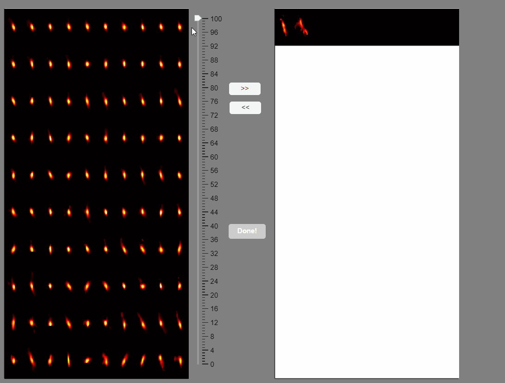

# Post-Processing


CaliAli incorporates a GUI to facilitate the identification of false-positive detections. 

After loading the `neuron` object stored in the [Checkpoint files](extraction.md#chk), execute the following function to call this GUI:

```
ix=postprocessing_app(neuron);
```
### Monitoring Extracted Components <a id="monitor_app"></a>

The post-processing app will display the correlation image with overlaid contours of the detected neurons. Clicking on these contours will show the corresponding extracted calcium transients:


You can hold you mouse to zoom:


You can reset the zoom and clear the neuronal selection by pressing the buttons located above the correlation image:


You can label false positives by right-clicking on the neuron contours:


### Sort Spatial Components <a id="spatial_sort"></a>

CaliAli can label false positives based on the shape of the extracted spatial components. To accomplish this, CaliAli incorporates a tool that sorts spatial components by their spatial congruence. To utilize this function, press the 'Separate Spatial' button.

This will open a panel displaying all the extracted spatial components. Components with congruent shapes are sorted at the beginning, while neurons with shapes different from the rest of the population are sorted last. Components labeled as false-positives will be listed on the right.



Note that elongated components, which could correspond to neuropil signals rather than neuron somas, appear at the bottom of the list. You can select these components and move them to the false-positive panel.


Once satisfied with the selections press the `Done!` button.

This will label the component as false-positive in the correlation image. 

### Deleting and Merging Components <a id="del_merge"></a>

Once you finish labeling false-positive in the main App press the `Done!` button.

This will create a variable `ix` holding the indices of the labeled false-positives.

You can delete these components by running `neuron.delete(ix);`. Alternatively, you can monitor each of these components with `neuron.viewNeurons(find(ix), neuron.C_raw);`.

After deleting false positives, you can consider merging neurons by manually monitoring neurons that are close by. For this, run`neuron.merge_high_corr(1, [0.1, 0.3, -inf]);`

???+ tip
	Note that you can save your results at any point running `save_workspace(neuron);`

### Picking Neurons from Residual <a id="residual"></a>

Some neurons may remain un-extracted after the initial processing. To extract potentially missed neurons run: `neuron=manually_update_residuals(neuron,use_parallel);`

This will open a GUI displaying the PNR, Corr., and PNR*Corr. images(1). These images will be shown in their original form (top panels) and also after subtracting the current neuron detections from the video (Residual video) (bottom panels).
{ .annotate }

1.	Refer to [Select Extraction Parameters](extraction.md#gui) for a description of the PNR, Corr. and PNR*Corr images.


Here, you can manually add initialization seeds for undetected neurons. Clicking on any of these images will place a red dot that initializes these neurons:


This will initialize these neurons and repeat the CNMF process required to [extract the Calcium signals](extraction.md#ecs).

After extracting the residual data, you may want to consider redoing the post-processing step described earlier

???+ Tip
	In most cases picking neurons is not necessary.


???+ Info "If you ever change the location of the videos"
	If you ever change the location of the videos and files generated during the analysis be sure to run [this steps](Utilities.md#update_path) after

---	
CONGRATULATIONS!: You have successfully extracted neuronal signals using CaliAli. Don't forget to save the results with `save_workspace(neuron)`

=== "Next"
We recommend checking the [Utilities](Utilities.md)  included with CaliAli.


