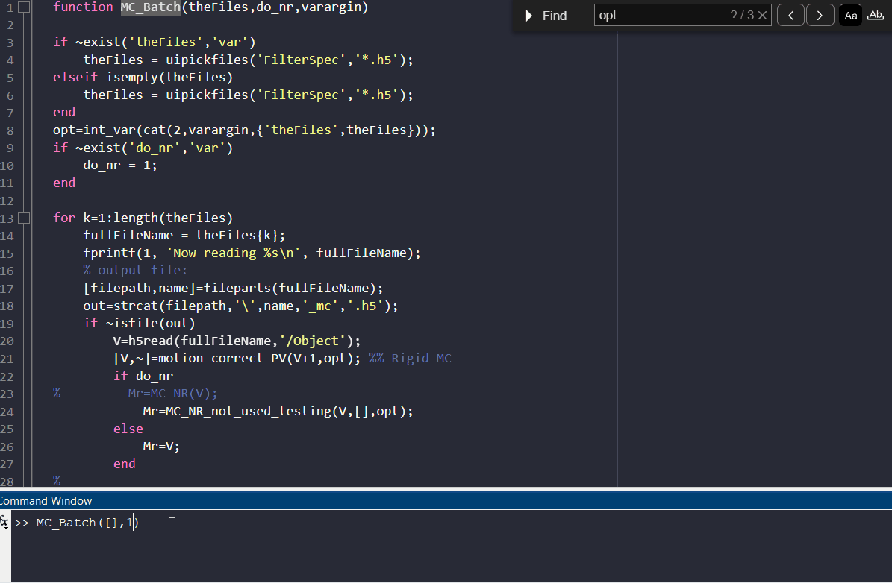

## I. Downsampling and Conversion to .h5 Format <a id="downsampling"></a>

The first step in the CaliAli pipeline is to convert the raw video format into the .h5 format used by CaliAli. This step is done together with spatial downsampling.

!!! Bug "Temporal downsampling"

	CaliAli currently does not support temporal downsampling. Use alternative methods prior to running these steps.

The function used to downsample video sessions would depende on the format of the source data:

### Syntax: <a id="syntax"></a>

=== ".avi"
	``` matlab
	Downsample_avi(ds_f, outpath, theFiles)	
	```
	This function reads AVI video files, downsamples them, and saves the resulting frames as an HDF5 (.h5) file.
	
	!!! Warning "Windows Users: Please note the following system-specific instructions"
		Matlab does not have the necessary codecs to process `.avi` files in windows. You need to download and install the [K-lite Codec Pack](https://codecguide.com/download_kl.htm) to be able to run this code.
	
=== ".tiff"
	``` matlab
	Downsample_tiff(ds_f, outpath, theFiles)		
	```
	This function reads tiff video files, downsamples them, and saves the resulting frames as an HDF5 (.h5) file.	
	
=== ".isdx (Inscopix)"
	``` matlab
	Downsample_inscopix(ds_f, outpath, theFiles)
	```
	This function reads Inscopix video files, downsamples them, and saves the resulting frames as an HDF5 (.h5) file.
	
	!!! Warning "Inscopix Users: Please note the following system-specific instructions"
		Note that this requires installing the Inscopix Data Processing software. 
		By defalt this funciton search for the Inscopix path in 'C:\Program Files\Inscopix\Data Processing'. If this path is not found, a folder selection dialog box will be called.

	
### Input Arguments: <a id="ia"></a>

-	ds_f (optional): Downsampling factor. Default is 1 (no downsampling).
-	outpath (optional): Output path for saving downscaled video files. If not provided, the files will be saved in the same directory as the input files.
-	theFiles (optional): Cell array containing paths to video files. If not provided, a file picker dialog will open to select video files interactively.	


### Example Usage:	<a id="eu"></a>
``` matlab
% Downsampling AVI files with a downsampling factor of 2
Downsample_avi(2);

% Do not Downsample AVI files and specifying an output path
Downsample_avi(1, 'C:\Output');

% Downsampling specific AVI files
files = {'video1.avi', 'video2.avi'};
Downsample_avi(2, 'C:\Output', files);
```
!!! Note
	We recommend using a 4x factor for Inscopix videos and 2x for UCLA miniscope V4 videos.


!!! Note
	You can monitor `.h5` data using the following function: [Play video data in .h5 format](Utilities.md#h5video) 

## II. Motion Correction <a id="mc"></a>

Following video downsampling, it is necessary to correct motion artifacts in each individual session.

For this we use the following function.
``` matlab
MC_Batch(theFiles, do_nr, varargin);
```	
The MC_Batch function processes a group of .h5 video files by applying motion correction techniques and saving the corrected videos to new HDF5 files.

!!! Note
	The output files will be suffixed with `_mc`. This suffix is necessary for subsequent modules to recognize files that have already undergone motion correction. 
	
!!! Note
	The motion correction process is relatively slow. A 10-minute video would be processed in 10 minutes. (1).
	{ .annotate }
	
	1.	~9 frames per second at a resolution of 300x300 pixels, using a 24-core processor (AMD Ryzen Threadripper 3960X). 
		

	
### Input Arguments:

-	theFiles (optional): Cell array containing paths to video files. If `[]` is provided, a file picker dialog will open to select video files interactively.
-	do_nr: (optional) Logical flag indicating whether to perform non-rigid motion correction (1 for yes, 0 for no). Default is 1.
-	gSig: Neuron Filter size (aprox. 1/4 of the nueron size in px). Default is 2.5 .
-	sf:	Frame rate. Default is 10 fps.
-	BVz: Size of blood vessels [min diameter max diameter] in pixels. Defaults is [0.6*gSig, 0.9*gSig].

### Example Usage:	
``` matlab

% Manually choose files and perform non-rigid motion correction. Set a frame rate of 15fps
MC_Batch([], 1,'sf',15);

% Manually choose files and perform rigid motion correction. Use a neuron Filter size of 3. 
MC_Batch([], 0,'gSig',3);

% Manually choose files and perform non-rigid motion correction. Use custom blood vessels size (not recommended).
MC_Batch([], 1,'BVz'[2,3]);
```


!!! danger "Important"
	Ensure to visually inspect the motion-corrected video before proceeding to the next step. [Play video data in .h5 format](Utilities.md#video_app)

=== "Next"	
After finishing downsampling and motion correction you can proceed to [Inter-session Alignment](alignment.md)

=== "FAQ"
	Why do we need to specify frame rate? (1).
	{ .annotate }

	1.  The motion correction module divides the data into smaller batches to accelerate the registration process. CaliAli uses the frame rate to calculate these segments.
	
	Why do we need to specify nueron filter size and blood vessels size(1).
	{ .annotate }

	1.  Neuron filter size is used to approximate the size of features within the field of view. For motion correction, this estimation is employed to determine the size of blood vessels, typically ranging from 0.6*gSig to 0.9*gSig in diameter. Users have the option to specify a different range of blood vessel diameters; in such cases, the parameter gSig becomes unnecessary.
	
	Can I use other motion correction modules other than CaliAli? (1).
	{ .annotate }
	
	1.	Not recommended. Certain motion correction algorithms, like NoRMCorre, may introduce vertical and horizontal artifacts at the concatenation point between patches, which can affect blood vessel extraction. Adjusting the BVz parameter may resolve these issues. If you are using different modules, remember to manually append the _mc suffix to the corrected files. After motion correction, all sessions should maintain consistent XY dimensions. Any padding borders should be filled with zeros.


