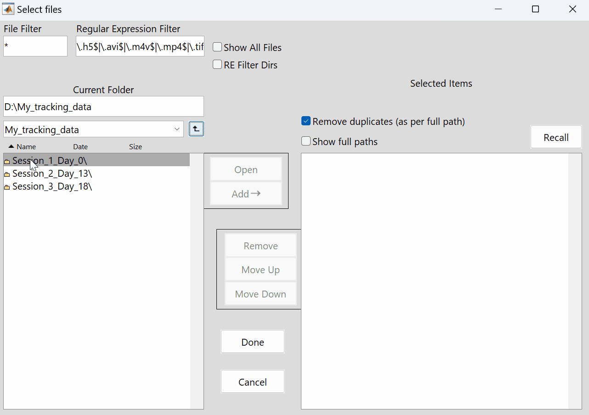

# Processing Video Sessions Split Into Multiple Files

It is common for continuous calcium imaging data to be saved across multiple video files for easier access. For example as follows:

```matlab
◼ My_data
├─ Session_1_day_0
│  ├─ 0.avi
│  ├─ 1.avi
│  ├─ ...
│  └─ 12.avi
├─ Session_2_day_5
│  ├─ 0.avi
│  ├─ 1.avi
│  ├─ ...
│  └─ 14.avi
└─ Session_3_day_15
   ├─ 0.avi
   ├─ 1.avi
   ├─ ...
   └─ 14.avi
```

Treating each of these split videos as independent sessions is not ideal, as using the inter-session alignment pipeline is more computationally demanding than simply aligning and motion-correcting the concatenated chunk.

The recommended approach is to select the **session folders** (here `Session_1_day_0`, `Session_2_day_5` and `Session_3_day_15`; you can select several at once) when calling:
```matlab
CaliAli_options = CaliAli_downsample(CaliAli_options);
```

CaliAli does not look inside subfolders, so selecting the parent folder `My_data` processes nothing.

For each selected folder, CaliAli downsamples every video with the configured file extension (`.avi` by default) and concatenates them, in [natural order](https://en.wikipedia.org/wiki/Natural_sort_order) of their file names (`2.avi` before `10.avi`), into one `_con.mat` file per session. The `_con.mat` files are saved next to the session folders, and the downsampled segments (`_ds.mat`) stay inside each session folder. The output will look like:

```matlab
◼ My_data
├─ Session_1_day_0
│  ├─ 0.avi
│  ├─ 0_ds.mat
│  ├─ ...
│  ├─ 12.avi
│  └─ 12_ds.mat
├─ Session_2_day_5
│  └─ ...
├─ Session_3_day_15
│  └─ ...
├─ Session_1_day_0_con.mat
├─ Session_2_day_5_con.mat
└─ Session_3_day_15_con.mat
```

Continue the pipeline with the `_con.mat` files.




??? Question "What about video sessions split into multiple TIFF files?"
    Set `file_extension` to the extension of your files. The simplest way is to edit the demo options:

    ```matlab
    edit CaliAli_demo_parameters
    ```

    and set `params.file_extension = 'tif';` for `.tif` files, or `params.file_extension = 'tiff';` for `.tiff` files. The extension must match exactly: `'tiff'` does not find `.tif` files.

## Sessions kept as several files <a id="same-session"></a>

If you process the pieces of a session as separate files instead of concatenating them, tell CaliAli which files belong to the same session with `same_ses_id`: one number per file, in the order the files are given to [inter-session alignment](alignment.md). For example, for four files where the first two belong to one session and the last two to another:

```matlab
params.same_ses_id = [1 1 2 2];   % in your copy of CaliAli_demo_parameters.m
```

Files with the same number are aligned as one session: they share the same non-rigid correction, and only a rigid shift is corrected between them. If `same_ses_id` is empty (the default), every file is treated as a different session.
