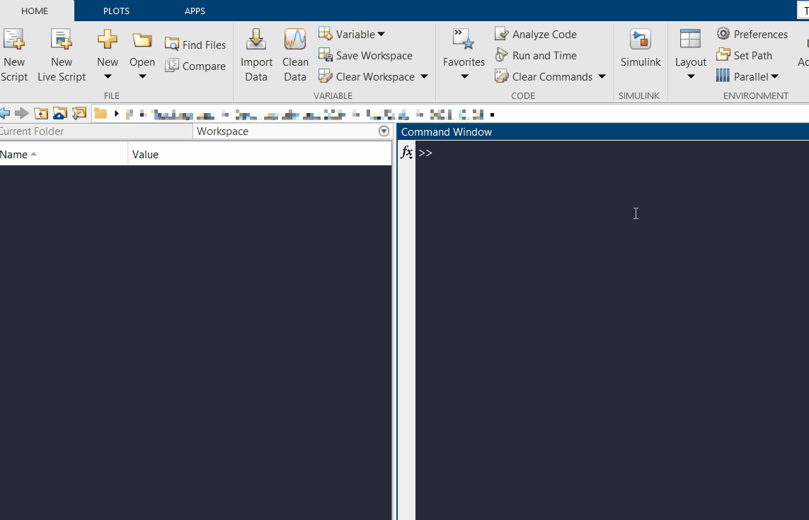

# Installation and system requirements

## System Requirement <a id="requirement"></a>
CaliAli runs in `MATLAB` and requires the following toolbox:
```
-	Signal Processing Toolbox
-	Image Processing Toolbox
-	Statistics and Machine Learning Toolbox'
-	Parallel Computing Toolbox
```
CaliAli has been tested successfully on `MATLAB` versions `2022a` and `2023a` running on Windows 11. No anticipated compatibility issues are expected with other operating systems.
 
### Hardware <a id="hardware"></a>

CaliAli automatically runs in batch mode, requiring only sufficient RAM to handle the largest imaging session and storing final outputs (less than 2GB if the largest session is 180x260 pixels and 3000 frames).

### Other Requirements <a id="other"></a>

!!! note "Process Inscopix data"
	To process Inscopix data, the [Inscopix Data Processing software](https://inscopix.com/software-analysis-miniscope-imaging/) needs to be installed.
	
!!! note "Process [UCLA miniscope](http://miniscope.org/index.php/Main_Page) data on Windows" 
	MATLAB does not have the necessary codecs to process `.avi` files. You need to download and install the [K-lite Codec Pack](https://codecguide.com/download_kl.htm).

## Installation <a id="installation"></a>
Installation should take a few minutes:

-	Download/clone the [Git](https://github.com/CaliAli-PV/CaliAli) repository of the codes
-	Add CaliAli to the MATLAB path.




=== "Next"
Already installed? Proceed to [Getting started](demo_data.md)