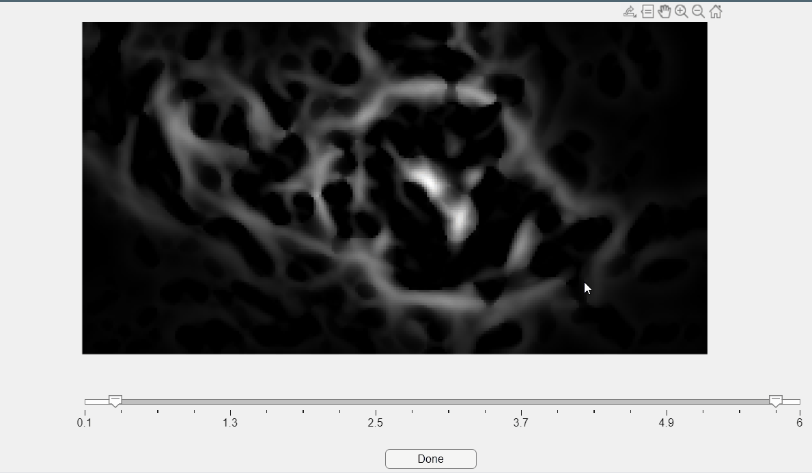

# Utilities

## Reproducing Video Data in .h5 Format <a id="h5video"></a>

To reproduce video data in `.h5` format, use the `view_Ca_video()` function and select the desired `.h5` file for monitoring(1).
{ .annotate }

1.	Code modified from Joao Henriques (2024). [Figure to play and analyze videos with custom plots on top](https://www.mathworks.com/matlabcentral/fileexchange/29544-figure-to-play-and-analyze-videos-with-custom-plots-on-top) , MATLAB Central File Exchange. 


This app includes the following functionalities:

-	++enter++ 	Play/Stop the video.
-	++back++	Play/Stop the video at 3x speed.
-	++left++/++right++	 Advance/go back one frame. Alternatively, you can use the scroll bar at the bottom of the screen.
-	++page-down++/++page-up++	Advance/go back 30 frames.
-	++c++	Adjust contrast settings in the video.

!!! bug
	When adjusting the contrast of the video, avoid using the `Adjust contrast` button. Instead, simply close the window by clicking the `[x]` button at the upper right corner of the screen.

## Monitoring Extracted Calcium Transients <a id="mt"></a>

CaliAli includes an app to plot the extracted calcium signals. After loading the `neuron` object, run `view_traces(neuron)`.


This app includes the following functionalities:

-	++left++ / ++right++ 	Scroll back or forward. Alternatively, you can use the scroll bar at the bottom of the screen.
- 	Use the vertical scroll bar to navigate through traces.
-	++ctrl+up++ / ++ctrl+down++	Increase/decrease the number of traces being displayed. 
-	++ctrl+right++ / ++ctrl+left++	Increase/decrease the temporal resolution.
-	Use the mouse scroll wheel to change the vertical zoom.
- 	Press the `C` button to plot the denoised traces.
- 	Press the `S` button to plot the predicted rising events.

## App for Optimal Blood Vessel Size Determination <a id="bv_app"></a>


Users can determine the optimal blood vessel size using `BV_app()`.



Control the sliders to define the minimum and maximum blood vessel width (in pixels). 
After pressing `Done`, the chosen blood vessel sizes will be printed in the command window. 
You can use these blood vessel sizes in other CaliAli functions by specifying the input pairs `'BVz'` and `[min, max]`.

!!! Note
	In many cases, the default blood vessel size yields satisfactory results. However, in certain preparations, horizontal or vertical artifacts may appear in the field of view. The Hessian filter approach used to enhance blood vessels could also extract these structures, which might hinder subsequent inter-session alignment. Customizing the blood vessel size could help avoid these issues.


## Separate Data from Different Sessions <a id="separate"></a>

Separates data into sessions based on frame information and optionally bins the data.

### Syntax:

```matlab
S = separate_sessions(data, F, bin, sf)
```

### Description:
This function separates data into sessions based on provided frame information (F). If F is not provided, the function prompts the user to select a file containing frame data. The data can be optionally binned using the specified bin size (bin) and sampling frequency (sf).

### Inputs:

-	***data:*** Matrix of data to be separated into sessions.

-	***F (optional)***: Frame information used to define intervals for separating sessions. If not provided, the user will be prompted to select a file.

-	***bin (optional)***: Bin size for binning the data. If set to 0, no binning is applied. Default is 0 if not specified.

-	***sf (optional)***: Sampling frequency used when binning the data. Default is 1 if not specified.

### Outputs:

-	***S***: Cell array containing separated session data.

### Example Usage:

```matlab
% Separate spike data with default bin size and sampling frequency (no binning)
S=separate_sessions(neuron.S, neuron.CaliAli_opt.F);

% Separate spike data with 1s bin considering Sampling frequency of 10.
S=separate_sessions(neuron.S, neuron.CaliAli_opt.F,1,10);

% Separate raw Calcim traces data with default bin size and sampling frequency (no binning)
S=separate_sessions(neuron.C_raw, neuron.CaliAli_opt.F);
```

## Other Functions <a id="of"></a>

### Save Workspace

```matlab
save_workspace(neuron);
```

### Updating Paths for Video and MAT Files <a id="update_path"></a>

If you've changed the location of the videos and files generated during the analysis, you'll need to run the following function and select the new 'source_extraction' folder.

```matlab
 neuron=update_folder_path(neuron);
save_workspace(neuron);
```

### Plot Neuron Contours <a id="coor"></a>

```matlab
%% To visualize neurons contours:
neuron.Coor=[]  

%% Plot over PNR image:
   neuron.show_contours(0.9, [], neuron.PNR, 0);  %PNR

%% Plot over correlation image:
   neuron.show_contours(0.6, [], neuron.Cn,0);   %CORR

%% Plot over PNR.Corr image:
  neuron.show_contours(0.6, [], neuron.Cn.*neuron.PNR,0); %PNR*CORR

%% Plot over neuron footprints:
 A=neuron.A;A=full(A./max(A,[],1)); A=reshape(max(A,[],2),[size(neuron.Cn,1),size(neuron.Cn,2)]);
 neuron.show_contours(0.6, [], A, 0);
```

