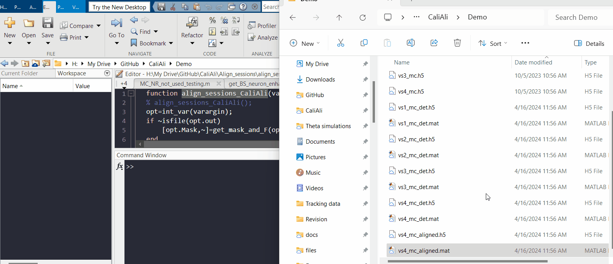

# Inter-session Alignment <a id="main"></a>

After [motion correction](Prep.md) of each session, they need to be aligned and concatenated. To achieve this, CaliAli performs the following steps:

1. **Detrend each imaging session:** This step involves removing part of the background fluorescence fluctuation.
   
2. **Calculate projections of the blood vessels and neurons:** Projections are computed to assist in subsequent alignment steps.

3. **Calculate displacement fields to align sessions using blood vessels and neurons:** Displacement fields are computed to accurately align the sessions.

4. **Apply displacement field to each video session:** This step involves applying the calculated displacement field to align the video sessions.

5. **Ensure standardized pixels:** Standardize pixels across sessions to the same baseline and noise level.

6. **Concatenate videos:** Finally, the aligned and standardized video sessions are concatenated to create a continuous sequence.

These steps are executed collectively by executing the following function:

### Syntax:

``` matlab
	align_sessions_CaliAli(Name,Value)
```
### Input Arguments:


-	gSig: Neuron Filter size (aprox. 1/4 of the nueron size in px). Default is 2.5 .
-	sf:	Frame rate. Default is 10 fps.
-	BVz: Size of blood vessels [min diameter max diameter] in pixels. Defaults is [0.6*gSig, 0.9*gSig].
-	n_enhanced: Logical flag indicating whether to use MIN1PIE background subtraction (1 for yes, 0 for no). The default value is 1
-	theFiles: Cell array containing paths to input video files. Default is to choose interactively.

### Example Usage:	

``` matlab
% Align video sessions with default parameters. Manually select video sessions
align_sessions_CaliAli();

% Align video sessions with custom neuron filter size and frame rate
align_sessions_CaliAli('gSig', 3, 'sf', 15);

% Align video sessions with MIN1PIE background subtraction disabled and specific input video files
videoFiles = {'path/to/video1.avi', 'path/to/video2.avi'};
align_sessions_CaliAli('n_enhanced', 0, 'theFiles', videoFiles);

% Align video sessions with specified blood vessel size
align_sessions_CaliAli('BVz', [5 20]);

% Align video sessions with custom parameters including all options
align_sessions_CaliAli('gSig', 2.5, 'sf', 10, 'n_enhanced', 1, 'theFiles', 'pickup', 'BVz', [5 20]);
```


!!! danger "Important"
	The order in which session are concatenated is determined by the other in which session are listed!
	
!!! note
	The `align_sessions_CaliAli()` function only detects files with the `_mc.h5` suffix. If you delete this suffix, the files will not be detected.
	
!!! note
	Much of the computation time is spent on calculating the neuron projections. However, this time is saved for subsequent analyses, as these images will be used during neuronal extraction. Completing the entire alignment process across four 10-minute sessions typically takes approximately 5 to 10 minutes.
	
### Output:	

After running `align_sessions_CaliAli()` function the following files will be created:

-	**Several .h5 file with the "_det" suffix**: These are the detrended and background removed version of each session. 
-	**A single.h5 file with the "_Aligned" suffix**: This is the concatenated data.
-	**Several .mat files**: These files stores relevant variables for subsequent analysis.


## Evaluating alignment performance: <a id="eval"></a>


During the execution of `align_sessions_CaliAli()`, you will see output similar to the following displayed in the command window:

```
Blood-vessel similarity score: 5.376
Calculating correlation of the Neurons projections... 
Processing:  100%  |############| 6/6it [00:00:00<00:00:00, 32.27 it/s]
Correlation between Neurons projections is good! 
Lowest spatial correlation: 0.491
``` 

The `Blood-vessel similarity score` reflects the usefulness of blood vessels in correcting inter-session misalignments. If this value falls below 2.7, CaliAli will issue a warning message and align sessions without relying on blood vessels (alignment dependent on neurons only).

The `spatial correlation value` indicates the correlation of the aligned neurons' projections. If this value is below 0.2, it may suggest substantial differences in active neurons across sessions, possibly due to displacement in the z-axis.

Next, To visually confirm the alignment performance, load the `*_Aligned.mat file` in MATLAB:



This will load the following components:

- **BV_score**: Blood-vessel similarity score
- **Cn**: Correlation image
- **F**: Number of frames in each session
- **n_enhanced**: Indicates whether MIN1PIE background subtraction was used
- **opt**: Structure containing relevant variables for subsequent analysis
- **P**: Table holding projections at different stages of the inter-session alignment process
- **PNR**: Peak-to-noise ratio image

The most important components is the tabe **P**, which is structured as follow: 

| Column        | Description                             |
| --------------| ----------------------------------------|
| `Original`    | Projections before alignment             |
| `Translation` | Projections after translation           |
| `Multi-Scale` | Projections after multi-scale alignment |
| `Final`       | Projections after final alignment       |

Each column contains a nested table with projections organized as 3D or 4D arrays, representing data from each session:

| Column        | Description                                          |
| --------------| -----------------------------------------------------|
| `Mean`        | Mean frame of each session                           |
| `BloodVessels`| Blood vessels projection of each session             |
| `Neurons`     | Neuron projections of each session                   |
| `PNR`         | PNR projections of each session                      |
| `BV+Neurons`  | Blood vessels and nuerons projection of each session |

You can visualize these projection with the following commands:

``` matlab
% Visualize BV+Neurons projection after alignment:
implay(P.(4)(1,:).(5){1,1});

% Visualize BV+Neurons projection before alignment:
implay(P.(1)(1,:).(5){1,1});

% Visualize BV+Neurons projection after translation:
implay(P.(2)(1,:).(5){1,1});

% Visualize BV+Neurons projection after translation and after final registration:
implay(catpad(2,mat2gray(P.(2)(1,:).(5){1,1}),mat2gray(P.(4)(1,:).(5){1,1})))

% Visualize Neurons projection after alignment:
implay(mat2gray(P.(4)(1,:).(3){1,1}));

```


!!! danger "Important"
	Please visually verify that sessions are correctly aligned. If you detect noticable displacement in the field of view it means that CaliAli is not suitable for this data.
	
After finishing inter-session aligment you can proceed to [Extract Calcium Traces with CaliAli](extraction.md)
	
## Processing single session: <a id="single"></a>

You can also use CaliAli to process individual sessions without performing video concatenation. This is particularly useful for verifying signal quality between long-term experiments by processing individual sessions.

To process sessions individually without concatenation, use the `detrend_batch_and_calculate_projections()` function instead of `align_sessions_CaliAli()`. The input parameters for `detrend_batch_and_calculate_projections()` are the same as those used for `align_sessions_CaliAli()`.

!!! note
	The `detrend_batch_and_calculate_projections()` function also calculates projections for individual sessions. This information is stored in a `.mat` file created after running the function. If you decide to concatenate sessions later, you can then run `align_sessions_CaliAli()` as usual. CaliAli will automatically read the previously created `.mat` files and utilize the pre-calculated projections.
	You should see something like this in the command window:
	
	```
	align_sessions_CaliAli();
	Obtaining registration borders and number of frames...
	Processing:  100%  |############| 4/4it [00:00:01<00:00:00, 3.80 it/s]
	Calculation of projections and detrending is already done for file "H:\My Drive\GitHub\CaliAli\Demo\v1_m_mc.h5".
	Calculation of projections and detrending is already done for file "H:\My Drive\GitHub\CaliAli\Demo\v2_m_mc.h5".
	Calculation of projections and detrending is already done for file "H:\My Drive\GitHub\CaliAli\Demo\v3_m_mc.h5".
	Calculation of projections and detrending is already done for file "H:\My Drive\GitHub\CaliAli\Demo\v4_m_mc.h5".
	```
	*This require all files to be located in the same folder

After finishing detrending individual files you can proceed to [Extract Calcium Traces with CaliAli](extraction.md)