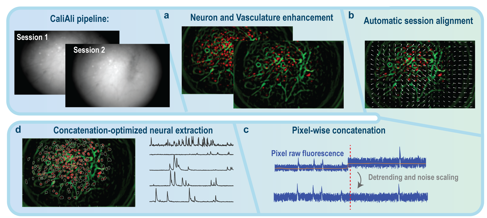

# Getting Started

This document provides guidance for running each module using four video sessions available in the CaliAli/Demos folder. However, you can apply these steps to your own data in a similar manner. Please note that the provided videos have already undergone motion correction. Details regarding the expected outputs of each module and their estimated running times are also included. 

!!! tip
	The raw calcium imaging videos described in the CaliAli paper can be found in the source data included with the manuscript.
	
??? Info "About Hierarchical Data Format Version 5"
	Note that CaliAli converts raw videos in .avi, .tiff, or .isdx format into .h5 during the downsampling process. Hierarchical Data Format (HDF5) allows loading several gigabytes of data in a few seconds and is ideal for processing multi-session data.

## CaliAli Processing Steps 

CaliAli requires executing the followin steps:

1. [Downsampling and Motion correction](Prep.md)

2. [Inter-session Alignment](alignment.md)

3. [Signal extraction from concatenated sessions](extraction.md)

4. [Post processing](Post.md)

??? Info "How long it takes to process the Demo data?"
	Processing the demo data is expected to take approximately 5-10 minutes on a standard desktop computer. This includes steps 2 to 4.

=== "Next"
To begin, proceed to [Downsampling and Motion correction](Prep.md)