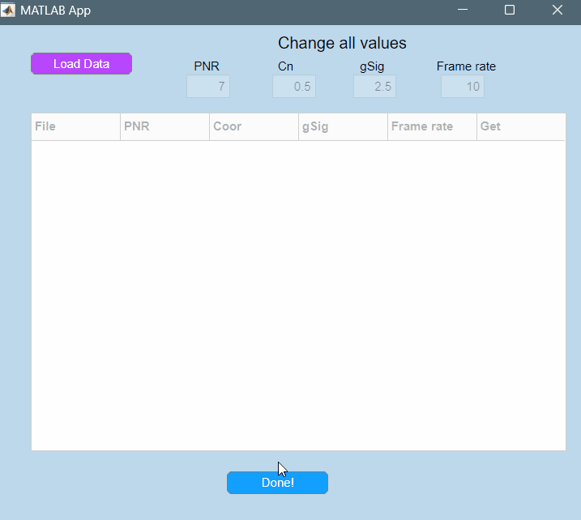
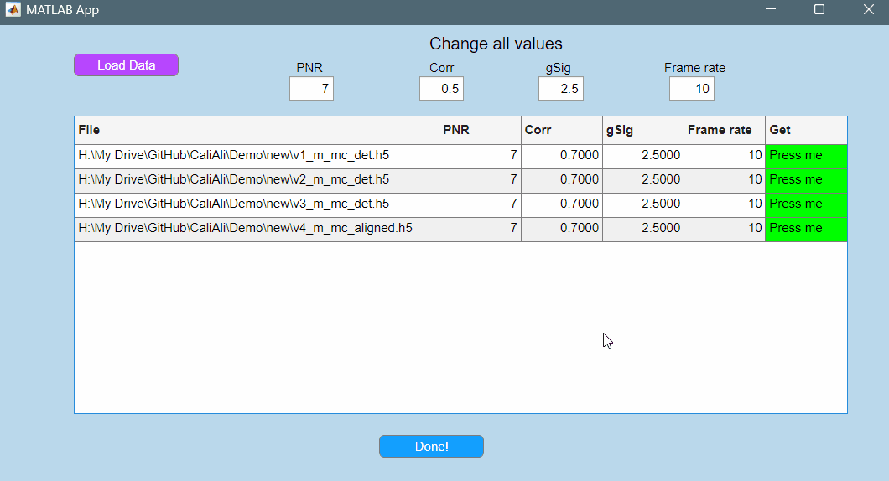
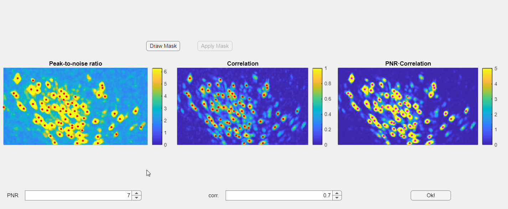
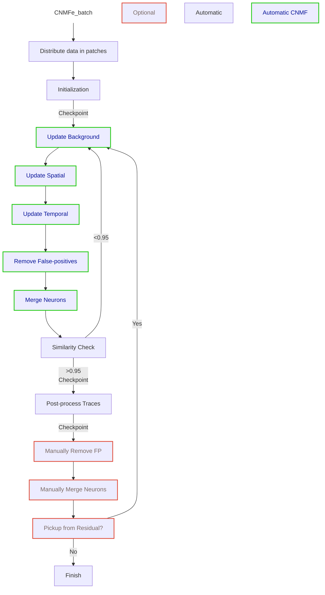

# Calcium Signal Extraction with CaliAli

After confirming that no errors occur during [session alignment and concatenation](alignment.md#main), you can proceed to extract neural signals.

This process involves two steps:

1. **Select Extraction Parameters for Each Session**: Utilize a graphical user interface to set initialization thresholds.
   
2. **Run the CaliAli Extraction Module**: Execute the CaliAli extraction module to extract neural signals.


## A GUI for Parameter Selection <a id="gui"></a>

The extraction of calcium signals relies on an initial estimation of neuron locations based on two key projections: the correlation image (showing pixel correlations) and the peak-to-noise ratio (PNR) image (highlighting active regions in the video). To accurately identify candidate neurons, specific minimum correlation and PNR thresholds must be defined. These thresholds are essential for distinguishing genuine neuron activity from background noise and signal fluctuations.

CaliAli offers a graphical user interface (GUI) for setting these thresholds visually.

You can use this GUI by running the following code:

```CNMFe_app```

This will open a window that allows the user to choose one or more `.h5` file for processing:



For each loaded file the user can modify the following parameters:

1.	PNR threshold (PNR)
2.	Correlation threshold (Corr)
3.	Neuron Filter size(gSig) (1).
	{ .annotate }
	
	1.	This parameter should match the settings used in previous steps. This will not be needed in future updates.
	
4.	Frame rate

!!! note
	You can process several files at the same time.

## Adjusting PNR and Corr. Thresholds <a id="adjust_pnr"></a>

To visually set the PNR and Corr. threshold press the `Get` button higlighted in green.



!!! Bug
	Sometimes, the MATLAB AppDesigner app may not render panels correctly. This is a MATLAB bug. If this happens, just close and reopen the window to fix the issue.

In the opened window, you will find three images displayed: the PNR image, the correlation image, and their point-wise product. Red dots overlaid on these images represent candidate neurons or "seed pixels". Below these images, there are two spinners that control the PNR and correlation thresholds. Adjusting these thresholds will change the number of seed pixels detected.




Additionally, you have the option to manually draw a mask to exclude specific regions within the field of view:


!!! Note
	Currently you can only draw the mask in the correlation image.
	
!!! Danger "Important"
	Please note that the initialization of neurons depends solely on the third panel, which is the point-wise product of the correlation and PNR (peak-to-noise ratio). Even if some seeds appear above non-neuronal structures in either the correlation or PNR images, this will not compromise the extraction process as long as those seeds do not appear in the point-wise product image
	
Once satisfied with the results press the `Ok!` button.
This will automatically update the parameters for the chosen file with the new thresholds. 

After setting the PNR, Corr, gSig, and Frame rate parameters press `Done!`
This will create a table named `parin` (parameters inputs) in the matlab workspace. 

!!! note
	Some parameters specific to CNMF-E are pre-defined in the `runCNMFe.mat` code and typically do not require modifications.  Refer to the original [CNMF-E documentation](https://github.com/zhoupc/CNMF_E/wiki/Pipeline#step-1-parameter-specification) for details.

## Extracting Calcium Signals <a id="ecs"></a>

After defining input parameters perform neuronal extraction by running the following command:

```matlab
CNMFe_batch(parin)
```
This will start processing each file in the parin table using the specified parameters.

The neuronal extraction process can be described by the following diagram:


During the execution of this code, you will see messages in the command window reflecting the steps depicted above. For example:

```
----------------UPDATE BACKGROUND---------------------------
Processing:  100%  |############| 4/4it [00:00:04<00:00:00, 1.06 it/s]

-----------------UPDATE SPATIAL---------------------------
Processing:  100%  |############| 4/4it [00:00:02<00:00:00, 1.45 it/s]

-----------------UPDATE TEMPORAL---------------------------
Processing:  100%  |############| 4/4it [00:00:05<00:00:00, 1.30 s/it]
Deconvolve and denoise all temporal traces again...
```

!!! question
	How does CaliAli deconvolve calcium signals? (1)
	{ .annotate }

	1.	CaliAli employs the original FOOPSI method with an AR(1) autoregressive model for initialization and matrix factorization (which is faster). During the final post-processing of traces, a thresholded FOOPSI approach with an AR(2) model is utilized (which is slower but more accurate). Learn more in the [OASIS documentation](https://github.com/zhoupc/OASIS_matlab/blob/master/document/FOOPSI.md#brief-summary-of-the-deconvolution-problem).


Note that there are three checkpoints during this process: one after Initialization, another after CNMF iterations, and a third after Post-processing of Calcium Traces.

The checkpoint files will be created as follows: <a id="chk"></a>

``` matlab
.
└─ <"file_name">_aligned_source_extraction/
   └─ frames_<"xxx">/
      └─ LOGS_<"DATE">/
         ├─ <"DATE-TIME">.mat "Checkpoint #1"
         ├─ <"DATE-TIME">.mat "Checkpoint #2"
         ├─ <"DATE-TIME">.mat "Checkpoint #3"
```

Loading any of these checkpoint files will load a `neuron` object containing the following properties:

 ``` matlab
	A: [27840×106 double]
	A_prev: [27840×106 double]
	C: [106×4000 double]
	C_prev: [106×4000 double]
	C_raw: [106×4000 double]
	S: [106×4000 double]
	kernel: [1×1 struct]
	b0: {2×4 cell}
	b0_new: [120×232 double]
	...
 ```
 Here the most important properties are:
 
 1. ***A***: Spatial components of neurons stored as a matrix d1*d2xN (1)
	{ .annotate }
	
	1. d1 and d2 are the x and y dimensions of the field of view and N is the number of neurons.
	
2. ***C_raw***: Extracted raw calcium traces stored as a matrix NxT (1)
	{ .annotate }
	
	1. N is the number of neurons and T is the number of frames. Fluorescent signals are expressed as SD above the noise level. This is what we use as raw dF/F0.  

3.	***C***: Denoised Calcium Signals. Same structure as C_raw.
	
4.	***S***: Raising events or Spikes. Same structure as C_raw.	(1)
	{ .annotate }
	
	1. This dataset contains the same information as dataset C, excluding the calculated rise and decay times of the calcium signals. S is recommended for most analyses.

=== "Next"	
After reaching the third checkpoint, the corresponding `.mat` file needs to be loaded into `MATLAB` to [post-process and verify the quality of the extracted signals](Post.md).
	

