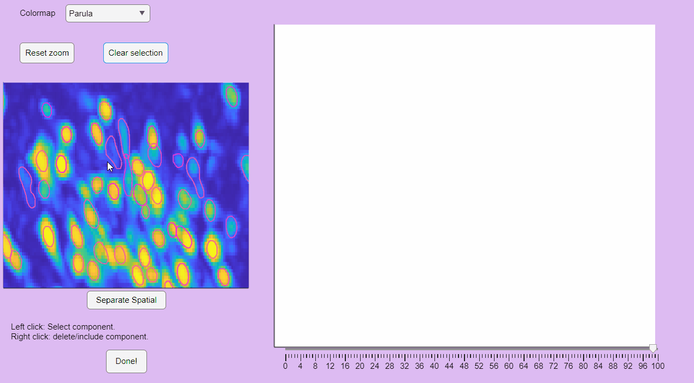

# Calcium Signal Extraction with CaliAli

After confirming [alignment quality](alignment.md#eval), you can proceed to CNMF-E extraction.

## Step 1: Set initialization thresholds <a id="gui"></a>

Use the initialization GUI to set `min_corr` and `min_pnr`:

```matlab
CaliAli_set_initialization_parameters(CaliAli_options)
Check_initialization_parameters(CaliAli_options)
```

Adjust thresholds if the seed preview is too sparse or too dense.

## Step 2: Run CNMF-E <a id="ecs"></a>

Run:

```matlab
CaliAli_cnmfe()
```

This opens a file selector; each selected file is processed in turn. For scripted usage without a picker, see [FAQ](FAQ.md#cnmfe-no-picker).

??? question "How does CaliAli deconvolve calcium signals?"
	CaliAli employs the original FOOPSI method with an AR(1) autoregressive model for initialization and matrix factorization (which is faster). During the final post-processing of traces, FOOPSI is run again with an AR(2) model (which is slower but more accurate). Learn more in the [OASIS documentation](https://github.com/zhoupc/OASIS_matlab/blob/master/document/FOOPSI.md#brief-summary-of-the-deconvolution-problem).

During extraction, CaliAli writes checkpoint files you can reload to continue analysis.

The checkpoint files are created next to the file you extract from, as follows: <a id="chk"></a>

``` matlab
.
└─ <"input file name">_source_extraction/
   └─ frames_1_<"number of frames">/
      └─ LOGS_<"DATE">/
         ├─ <"DATE-TIME">.mat "Checkpoint #1"
         ├─ <"DATE-TIME">.mat "Checkpoint #2"
         ├─ <"DATE-TIME">.mat "Checkpoint #3"
```

!!! tip "You can easily monitor the extracted calcium transients by running [view_traces(neuron)](Functions_doc/view_traces.md)"
		
		
## Post-processing detected components

CaliAli includes a GUI to label false positives. After loading `neuron` from a [checkpoint](#chk):

```matlab
ix = postprocessing_app(neuron, 0.6);   % 0.6: threshold for drawing the contours
```

The app shows the correlation image with the contour of each detected component. Left-click a contour to see its calcium trace, and right-click it to label it as a false positive. The **Separate Spatial** button sorts all components by shape and lists the odd ones last, such as elongated components that are more likely neuropil than cell bodies, so you can move them to the false-positive list. Press `Done!` when finished: `ix` then marks the components you labeled. See [postprocessing_app()](Functions_doc/postprocessing_app.md#postprocessing_app) for a step-by-step walkthrough.



Review the labeled components if you wish, then delete them:

```matlab
neuron.viewNeurons(find(ix), neuron.C_raw);   % optional: inspect them one by one
neuron.delete(ix);
```

## Merging components

After deleting false positives, you can merge overlapping components:

```matlab
neuron.merge_high_corr(1, [0.1, 0.3, -inf]);
```

!!! tip "Note that you can create a new checkpoint at any point running `save_workspace(neuron);`"

## Picking Neurons from Residual <a id="residual"></a>

Some neurons may remain un-extracted after the first pass. To add them by hand, run [`manually_update_residuals()`](Functions_doc/manually_update_residuals.md#manually_update_residuals):

```matlab
neuron = manually_update_residuals(neuron, 0.6, true);   % contour threshold, use parallel processing
```

A window shows the peak-to-noise ratio (PNR), correlation, and PNR·correlation images of the video (top) and of the residual, what is left after removing the detected neurons (bottom). Bright spots in the residual are likely missed neurons: click them to place a seed, then press `Ok!`. CaliAli extracts the new neurons, updates the existing ones, and saves a new checkpoint.


In most cases this step is not necessary. If you run it, consider repeating the post-processing above.

!!! info "If you move your files"
    If you move the videos or the files created during the analysis, run [update_folder_path()](Utilities.md#update_path) before continuing.

## Preparing extracted signals for analysis

CaliAli performs final detrending and noise scaling automatically at the end of the pipeline. Related functions:

- [detrend_Ca_traces()](Functions_doc/detrend_Ca_traces.md#detrend_Ca_traces) 
- [scale_to_noise()](Functions_doc/scale_to_noise.md#scale_to_noise) 
- [postprocessDeconvolvedTraces()](Functions_doc/postprocessDeconvolvedTraces.md#postprocessDeconvolvedTraces) 

=== "CONGRATULATIONS!"
You have successfully extracted neuronal signals using CaliAli. Don't forget to save the results with `save_workspace(neuron)`. For other useful functions, see [Utilities](Utilities.md).
	


<a id="background-model"></a>
??? Warning "Only the ring background model is supported"
    CaliAli uses the **ring** background model, and it is the default. The `svd`
    and `nmf` models are inherited from CNMF-E, where they were written for
    two-photon recordings, and they were never implemented for the batched
    extraction CaliAli runs.

    Setting `background_model` to anything other than `'ring'` produces a
    warning and falls back to ring, rather than stopping the run. A setting
    carried over from a CNMF-E script therefore costs you a message, not an
    analysis you did not ask for.
